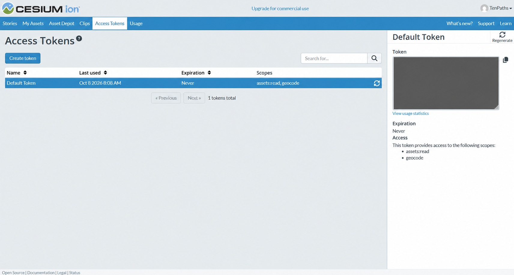
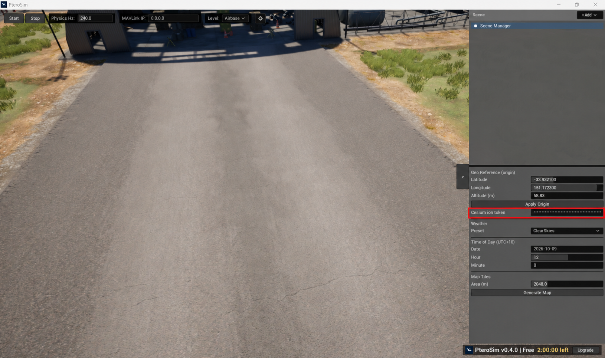
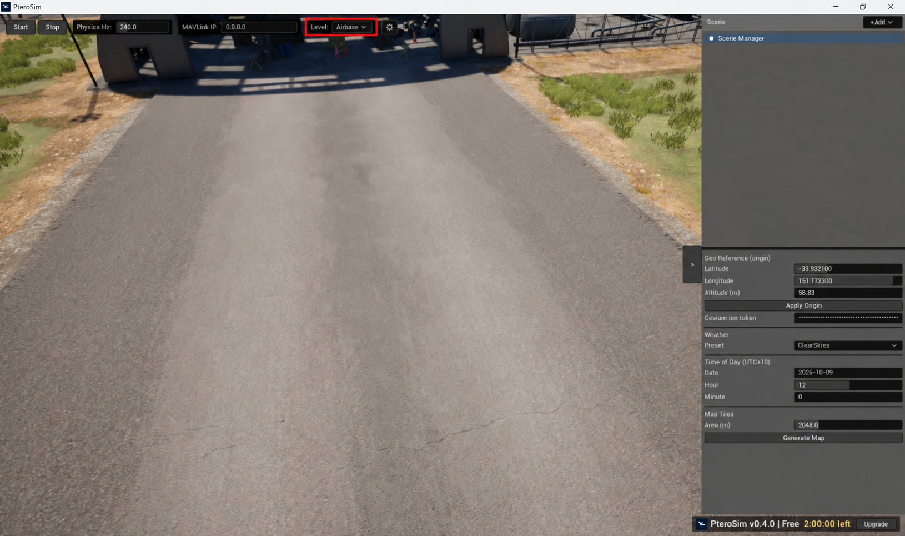

Connect to Cesium ion
=====================

PteroSim uses `Cesium ion <https://ion.cesium.com/>`_ to stream the 3D terrain
and imagery used by its tiled worlds. You need a Cesium ion account and an
access token before those worlds can load.

Get an access token
-------------------

1. Sign in to `Cesium ion <https://ion.cesium.com/>`_, or create an account.
2. Open **Access Tokens** in the top navigation.
3. For a quick local test, select **Default Token** and copy the value shown in
   the **Token** box. For a token you plan to keep using, select **Create
   token**, give it a name such as ``PteroSim``, and grant it the
   ``assets:read`` scope.

For more information about scopes, asset restrictions, rotation, and usage, see
Cesium's `Access Tokens guide
<https://cesium.com/learn/ion/cesium-ion-access-tokens/>`_.

Enter the token in PteroSim
---------------------------

1. Make sure the simulation is stopped. Scene settings and the level picker are
   locked while the simulation is running.
2. In the panel on the right, select **Scene Manager**. Its details appear at
   the bottom of the panel.
3. Paste the token into **Cesium ion token**, then press :kbd:`Enter` or click
   outside the field to commit it. The field masks the value after it is pasted.

PteroSim saves the token in the current user's settings and reuses it the next
time the application starts. On an already open tiled world, committing the
token starts or reloads the tiles immediately. A loading notification reports
the progress and closes after the selected view has loaded.

Open a tiled world
------------------

1. Find **Level** in the control bar at the top.
2. Select the current level, such as **Airbase**, to open the level menu.

3. Choose **Earth (3D tiles)**, **Mars (3D tiles)**, or another tiled world
   included in your build. **Airbase** is the built-in local level and does not require Cesium ion.
4. Confirm **Load**. Loading another level reloads the world, removes any
   aircraft in the current one, and starts streaming the selected world's tiles.
5. Wait for the **3D tiles loaded** notification before placing an aircraft or
   moving the geographic origin.
