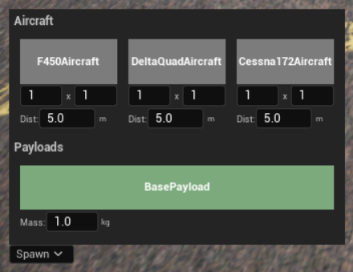

First Steps
===========

Open the Spawn panel
--------------------

After launching PteroSim, find the **Spawn** button in the lower-left corner of the screen.  
Clicking it opens the aircraft and payload spawn panel:

Aircraft grid
-------------

Each aircraft card has controls of the form ``1 x 1`` and a **Dist** field:

* **1 × 1** — how many aircraft to spawn along each side of the grid.
* **Dist** — side length of the grid in meters.

Aircraft types
--------------

* **F450Aircraft** — four rotor drone.
* **DeltaQuadAircraft** — VTOL with four vertical lift rotors and one rear-facing propeller.
* **Cessna172Aircraft** — fixed-wing airplane.

Payloads
--------

* **BasePayload** spawns a cargo box with configurable **Mass (kg)**.  
  Aircraft equipped with a gripper can lift this box and use it as a payload in scenarios.

Taking Flight
-------------

1. **Start the PteroSim simulation.**  
   Launch PteroSim and press the **Start** button to run the simulation.

2. **Configure QGroundControl communication.**  
   Open QGroundControl and go to **Application Settings**:

   .. image:: Images/qgc_main_menu.png
      :alt: QGroundControl main menu and Application Settings
      :align: center

   In the left sidebar select **Comm Links** and create or edit a link so that it matches your simulator setup:

   .. image:: Images/qgc_comm_link.png
      :alt: QGroundControl communication link configuration
      :align: center

3. **Run PX4 SITL.**  
   On Ubuntu (or WSL), in the root folder of your PX4 source tree, run:

   .. code-block:: bash

      PX4_SIM_HOSTNAME=<YOUR_HOST_IP_ADDRESS> PX4_LOCKSTEP=1 PX4_SIM_SPEED_FACTOR=1 make px4_sitl none_iris

   After a few seconds the PX4 console should report that it is **ready for takeoff**.

4. **Connect QGroundControl and plan a mission.**  
   In QGroundControl click **Disconnected – Click to manually connect** and choose the link (for example **Drone1**) to connect:

   .. image:: Images/qgc_connect_link.png
      :alt: QGroundControl select link to connect
      :align: center

   Once connected, you can use the Plan view to create missions with waypoints, takeoff and landing commands, and other actions.

