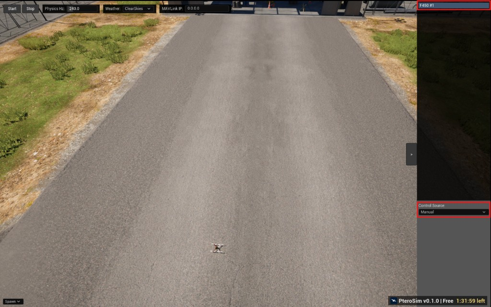

First Steps
===========

1. Open the Spawn panel

After launching PteroSim, find the **Spawn** button in the lower-left corner of the screen.  
Clicking it opens the aircraft and payload spawn panel:

.. image:: Images/spawn_panel.png
   :alt: Aircraft and payload spawn panel
   :class: no-float-left

2. On the spawn panel, press and hold the cursor on your target aircraft, then drag it into the scene. Spawning is only possible when the simulation is stopped.

3. Press **Start** button to start the simulation.

4. On the panel to the right, choose manual control source for the aircraft.

5. Press ``P`` to possess the aircraft. Possessing the aircraft first is required for manual control.

6. Use the following keys for manual flight control. Simulation must be started for aircraft to act.

.. list-table::
   :header-rows: 1

   * - Command
     - Key Shortcut
   * - Possess/unpossess aircraft
     - ``P`` / ``Esc``
   * - Take off
     - ``Space``
   * - Descend
     - ``Ctrl``
   * - Move forward / backward
     - ``W`` / ``S``
   * - Move left / right
     - ``A`` / ``D``
   * - Yaw left / right
     - ``Q`` / ``E``
   * - Pick up or release payload
     - ``G``

For different control sources, use the panel to the right of the screen.

