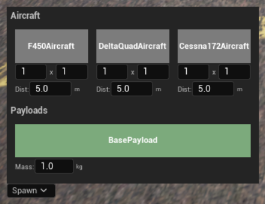

First Steps
===========

Open the Spawn panel
--------------------

After launching PteroSim, find the **Spawn** button in the lower-left corner of the screen.  
Clicking it opens the aircraft and payload spawn panel:

Simulation controls
-------------------

* Use Start/Pause and Stop buttons to control the simulation state.
* Use Time Scale, Physics Hz, Weather, Wind kts and Dir windows to control phyiscal atributes of the simulation.
* Panel to the right lists all existing aircraft and payloads and can be used to change control sources for aircraft; it is open by default.

Aircraft grid
-------------

Each aircraft card has controls of the form ``1 x 1`` and a **Dist** field:

* **1 × 1** — how many aircraft to spawn along each side of the grid.
* **Dist** — side length of the grid in meters.

Aircraft types
--------------

* **F450Aircraft** — four rotor drone.

Payloads
--------

* **BasePayload** spawns a cargo box with configurable **Mass (kg)**.  
  Aircraft equipped with a gripper can lift this box and use it as a payload in scenarios.

Taking Flight
-------------

Manual Control
^^^^^^^^^^^^^^

Use these keys for manual flight control:

.. list-table::
   :header-rows: 1

   * - Command
     - Key Shortcut
   * - Take off
     - ``Space``
   * - Descend
     - ``Ctrl``
   * - Move forward / backward
     - ``W`` / ``S``
   * - Move left / right
     - ``A`` / ``D``
   * - Yaw left / right
     - ``Q`` / ``E``
   * - Pick up or release payload
     - ``G``

