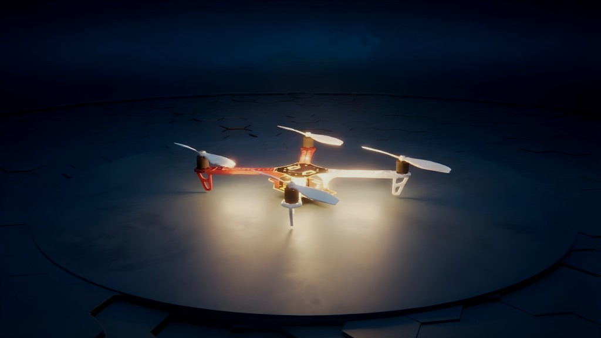

PteroSim Documentation
======================

Welcome to the PteroSim documentation.

.. note::

   This project is under active development.

Getting Started
---------------

:doc:`getting_started` — System requirements, software requirements, and setup instructions.

First Steps
-----------

:doc:`first_steps` — Basic spawning workflow for aircraft and payloads.

Python API
----------

:doc:`python_api` — Python API commands for programmatic simulation control.

.. toctree::
   :maxdepth: 1
   :hidden:

   getting_started
   first_steps
   python_api
