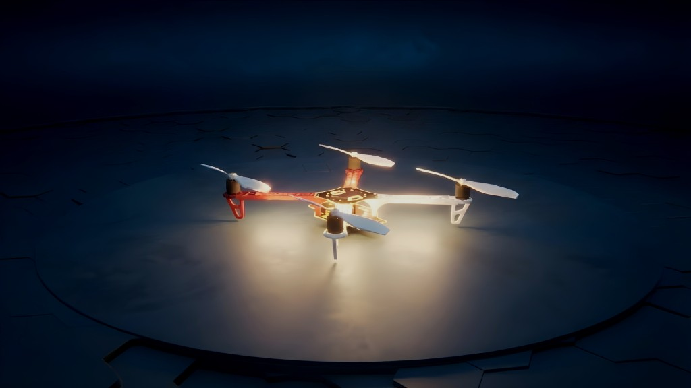

PteroSim Documentation
======================

Welcome to the PteroSim documentation.

.. note::

   This project is under active development.

Getting Started
---------------

:doc:`getting_started` — System requirements, software requirements, and setup instructions.

First Steps
-----------

:doc:`first_steps` — Basic spawning workflow for aircraft and payloads.

SITL Simulation
---------------

:doc:`sitl_simulation_px4` — PX4 SITL workflow with QGroundControl.
:doc:`sitl_simulation_ardupilot` — ArduPilot SITL workflow with Mission Planner.

Python API
----------

:doc:`python_api` — Python API commands for programmatic simulation control.
For ready-to-run usage examples, see `PteroSimScripts on GitHub <https://github.com/AlexanderRex/PteroSimScripts>`_.

Headless & Automation
---------------------

:doc:`headless` — Windowless runs for CI, Docker, and RL: render flags and headless EULA consent.

.. toctree::
   :maxdepth: 1
   :hidden:

   getting_started
   first_steps
   sitl_simulation_px4
   sitl_simulation_ardupilot
   python_api
   headless
